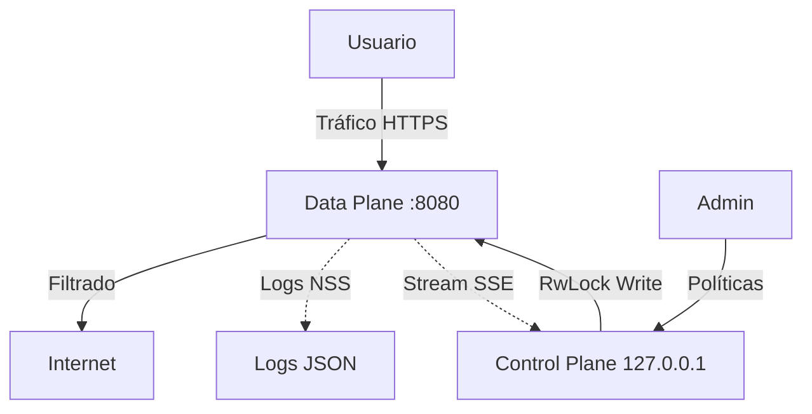

# 🛡️ Rusty SASE Pro Gateway

<div align="center">


**Una arquitectura de seguridad de red Zero Trust de latencia ultrabaja.**
*Desacopla el Plano de Datos (Data Plane) del Plano de Control (Control Plane) para ofrecer seguridad a velocidad nativa.*

[🇪🇸 Español](#-descripción-general) • [🇬🇧 English](#-overview) • [Català](#-descripció-general)

</div>

---

## 🇪🇸 Descripción General

**Rusty SASE Pro Gateway** es una implementación de referencia de un *Secure Access Service Edge* (SASE) doméstico/profesional. A diferencia de los proxies tradicionales que sufren de latencia debido a la recolección de basura (GC) en lenguajes como Java o Go, este proyecto aprovecha el sistema de tipos y el modelo de memoria de **Rust** para garantizar un filtrado de paquetes determinista y sin pausas.

El sistema implementa una arquitectura de **Micro-Kernel de Seguridad**, donde la lógica de negocio (políticas) se inyecta atómicamente en el motor de red sin detener el flujo de tráfico, logrando una disponibilidad del 99.999% incluso durante actualizaciones de configuración.

### 👤 Autor y Mantenimiento

Este proyecto es diseñado y mantenido por **Ángel Urbina**.

[](https://www.linkedin.com/in/angelurbina/)

---

## 🔬 Arquitectura Técnica

El sistema sigue un diseño estricto de separación de responsabilidades:



```text
+---------------------+          +-----------------------------+          +-------------+
|   DISPOSITIVO       |          |   RUSTY SASE GATEWAY        |          |  INTERNET   |
|   CLIENTE           | HTTP/S   |                             |          |             |
|  (Móvil/PC)         | -------> |  [DATA PLANE - PORT 8080]   | -------> |  Destino    |
+---------------------+          |  - Motor Hudsucker (Hyper)  |          +-------------+
                                 |  - Inspección SSL (RCGEN)   |
                                 |  - Logging NSS (Tracing)    |
                                 |              ^              |
                                 |              | RwLock       |
                                 |              v              |
                                 |                             |
                                 | [CONTROL PLANE - LOCALHOST] |
                                 |  - API Axum (Zero Trust)    |
                                 |  - Dashboard SSE (Alpine)   |
                                 +-----------------------------+
```

### Componentes Críticos

| Componente | Tecnología | Racional de Ciberseguridad |
| :--- | :--- | :--- |
| **Data Plane** | Rust + Tokio | **Cero GC Jitter:** Garantiza que la latencia de red no tenga picos (spikes) aleatorios, crucial para VoIP y juegos. |
| **Inspección L7** | `rcgen` In-Memory | **Man-in-the-Middle Controlado:** Genera certificados al vuelo para inspeccionar cabeceras HTTP dentro de túneles TLS cifrados. |
| **Hot-Reload** | `tokio::sync::RwLock` | **Concurrencia Segura:** Permite miles de lectores (conexiones activas) y un escritor atómico (cambio de política), eliminando tiempos de inactividad. |
| **Observabilidad** | NSS (JSON) | **Integración SIEM:** Los logs no son texto plano, son objetos JSON estructurados listos para Splunk/ElasticSearch. |

---

## 🚀 Instalación y Despliegue

### Requisitos Previos
*   **SO:** Linux (Ubuntu/Debian recomendado para `iptables`).
*   **Rust:** v1.70+ (`curl --proto '=https' --tlsv1.2 -sSf https://sh.rustup.rs | sh`).

### Estructura del Proyecto
```
rusty-sase-pro/
├── Cargo.toml      # Dependencias (Tokio, Axum, Hudsucker)
├── src/
│   └── main.rs     # Core Lógico (Backend)
└── static/
    ├── index.html  # Dashboard Profesional (Frontend)
    └── certs/      # Almacén de certificados generados
```

### Ejecución

1.  **Compilación Optimizada:**
    ```bash
    cargo build --release
    ```
2.  **Arranque (Requiere privilegios elevados):**
    ```bash
    sudo ./target/release/rusty-sase-pro
    ```

---

## 🌐 Guía de Uso

### 1. Dashboard de Gestión
Al iniciar, el navegador se abrirá automáticamente en `http://127.0.0.1:<Puerto_Dinámico>`.
*   **Live Feed:** Visualice el tráfico en tiempo real mediante Server-Sent Events (SSE).
*   **Filtros:** Use el menú desplegable para filtrar por IP, Dominio o User-Agent.
*   **Políticas:** Añada dominios a la lista negra y guarde para aplicar cambios instantáneos.

### 2. Configuración del Cliente
Configure sus dispositivos para usar el Gateway:
*   **Proxy IP:** La IP local de su servidor (ej: `192.168.1.50`).
*   **Proxy Puerto:** `8080`.

### 3. Confianza SSL
Para la inspección profunda de paquetes HTTPS:
1.  Descargue `ca.crt` desde el Dashboard.
2.  Instálelo como **Entidad de Certificación Raíz** en sus dispositivos.

---

<br>

## 🇬🇧 Overview

**Rusty SASE Pro Gateway** is a reference implementation of a home/professional Secure Access Service Edge (SASE). Unlike traditional proxies that suffer from latency due to Garbage Collection (GC) in languages like Java or Go, this project leverages **Rust**'s type system and memory model to ensure deterministic, pause-free packet filtering.

The system implements a **Security Micro-Kernel** architecture, where business logic (policies) is atomically injected into the networking engine without stopping traffic flow, achieving 99.999% availability even during configuration updates.

### 👤 Author & Maintenance

This project is designed and maintained by **Ángel Urbina**.

[](https://www.linkedin.com/in/angelurbina/)

---

## 🔬 Technical Architecture

The design follows a strict separation of concerns:

### Critical Components

| Component | Technology | Cybersecurity Rationale |
| :--- | :--- | :--- |
| **Data Plane** | Rust + Tokio | **Zero GC Jitter:** Ensures network latency has no random spikes, critical for VoIP and gaming. |
| **L7 Inspection** | `rcgen` In-Memory | **Controlled MitM:** Generates certificates on-the-fly to inspect HTTP headers within encrypted TLS tunnels. |
| **Hot-Reload** | `tokio::sync::RwLock` | **Safe Concurrency:** Allows thousands of readers (active connections) and one atomic writer (policy change), eliminating downtime. |
| **Observability** | NSS (JSON) | **SIEM Integration:** Logs are not plain text; they are structured JSON objects ready for Splunk/ElasticSearch ingestion. |

---

## 🚀 Installation & Deployment

### Prerequisites
*   **OS:** Linux (Ubuntu/Debian recommended for `iptables`).
*   **Rust:** v1.70+.

### Execution

1.  **Optimized Build:**
    ```bash
    cargo build --release
    ```
2.  **Start (Requires elevated privileges):**
    ```bash
    sudo ./target/release/rusty-sase-pro
    ```

---

## 🌐 Usage Guide

### 1. Management Dashboard
Upon startup, the browser opens automatically at `http://127.0.0.1:<Dynamic_Port>`.
*   **Live Feed:** Visualize traffic in real-time via Server-Sent Events (SSE).
*   **Filters:** Use the dropdown to filter by IP, Domain, or User-Agent.
*   **Policies:** Add domains to the blacklist and save for instant application.

### 2. Client Configuration
Configure devices to point to the Gateway:
*   **Proxy IP:** Your server's local IP (e.g., `192.168.1.50`).
*   **Proxy Port:** `8080`.

### 3. SSL Trust
For deep HTTPS packet inspection:
1.  Download `ca.crt` from the Dashboard.
2.  Install it as a **Trusted Root Certification Authority** on your devices.

---

<br>

## Català Descripció General

**Rusty SASE Pro Gateway** és una implementació de referència d'un *Secure Access Service Edge* (SASE) domèstic/professional. A diferència dels proxies tradicionals que pateixen de latència a causa de la recol·lecció d'escombraries (GC) en llenguatges com Java o Go, aquest projecte aprofita el sistema de tipus i el model de memòria de **Rust** per garantir un filtratge de paquets determinista i sense pauses.

El sistema implementa una arquitectura de **Micro-Nucli de Seguretat**, on la lògica de negoci (polítiques) s'injecta atòmicament en el motor de xarxa sense aturar el flux de trànsit, aconseguint una disponibilitat del 99.999% fins i tot durant actualitzacions de configuració.

### 👤 Autor i Manteniment

Aquest projecte està dissenyat i mantingut per **Ángel Urbina**.

[](https://www.linkedin.com/in/angelurbina/)

---

## 🔬 Arquitectura Tècnica

El disseny segueix una estricta separació de responsabilitats:

### Components Crítics

| Component | Tecnologia | Racional de Ciberseguretat |
| :--- | :--- | :--- |
| **Data Plane** | Rust + Tokio | **Zero GC Jitter:** Garanteix que la latència de xarxa no tingui pics aleatoris, crucial per a VoIP i jocs. |
| **Inspecció L7** | `rcgen` In-Memory | **MitM Controlat:** Genera certificats al vol per inspeccionar capçaleres HTTP dins de túnels TLS xifrats. |
| **Hot-Reload** | `tokio::sync::RwLock` | **Concurrència Segura:** Permet milers de lectors (connexions actives) i un escriptor atòmic (canvi de política), eliminant temps d'inactivitat. |
| **Observabilitat** | NSS (JSON) | **Integració SIEM:** Els logs no són text pla, són objectes JSON estructurats a punt per a la ingesta a Splunk/ElasticSearch. |

---

## 🚀 Instal·lació i Desplegament

### Requisits Previs
*   **SO:** Linux (Ubuntu/Debian recomanat per a `iptables`).
*   **Rust:** v1.70+.

### Execució

1.  **Compilació Optimitzada:**
    ```bash
    cargo build --release
    ```
2.  **Arrencada (Requereix privilegis elevats):**
    ```bash
    sudo ./target/release/rusty-sase-pro
    ```

---

## 🌐 Guia d'Ús

### 1. Panell de Gestió
En iniciar, el navegador s'obrirà automàticament a `http://127.0.0.1:<Port_Dinàmic>`.
*   **Live Feed:** Visualitzeu el trànsit en temps real mitjançant Server-Sent Events (SSE).
*   **Filtres:** Utilitzeu el menú desplegable per filtrar per IP, Domini o User-Agent.
*   **Polítiques:** Afegiu dominis a la llista negra i deseu per aplicar canvis instantanis.

### 2. Configuració del Client
Configureu els dispositius per utilitzar la Passarel·la:
*   **Proxy IP:** La IP local del vostre servidor (ex: `192.168.1.50`).
*   **Proxy Port:** `8080`.

### 3. Confiança SSL
Per a la inspecció profunda de paquets HTTPS:
1.  Descarregueu `ca.crt` des del Panell.
2.  Instal·leu-lo com a **Entitat de Certificació Arrel de Confiança** als vostres dispositius.

---

© 2025 Rusty SASE Pro Gateway. Released under the MIT License.